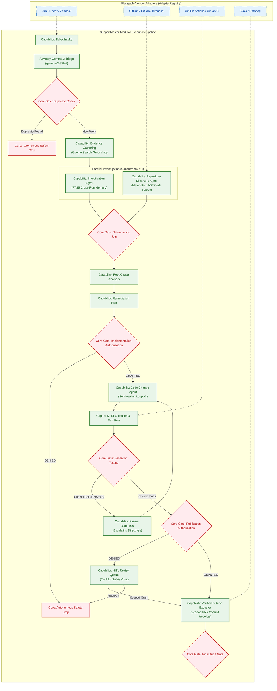

# SupportMaster: Hackathon Narrative (All Things Agentic)

SupportMaster is a production-ready, fully autonomous customer support ticket resolver governed by deterministic safety gates, cross-run memory, and multi-agent coordination.

---

## 1. Why SupportMaster Wins the "All Things Agentic" Track

Many hackathon submissions are simple wrappers around LLM text generation. SupportMaster is built on a **true multi-agent orchestration architecture**:



### Key Differentiators
1. **21 Specialized Collaborative Agents**: Each agent owns a micro-responsibility (e.g., ticket analysis, repository search, implementation, test verification, safety audits, escalation routing).
2. **Self-Healing Execution Sandbox (Unique Robustness)**: If validation checks or tests fail during execution, the system doesn't immediately halt. It intercepts failures, records the error traces in state, and routes execution back to the code modification loop to auto-correct the bug (up to 3 retries). If all attempts fail, it logs a rollback receipt and safely restores the repository state.
3. **Interactive HITL Co-Pilot Chat (Unique Human-in-the-Loop)**: Human operators don't just passively click Approve/Reject at gates. Through the co-pilot chat endpoint, they can conversationalize with the review copilot, asking questions about risks, code diffs, or validation gaps before unlocking safety-critical locks.
4. **Cross-Run SQLite FTS5 Memory**: Using an TF-IDF-based virtual search index, agents record the outcome of every resolved ticket and retrieve similar past resolutions to guide new investigations.
5. **Deterministic Safety Gating**: Instead of trusting the LLM to verify its own work, the system runs all proposals through code validation suites, Git verification scripts, and tenant-scoped security validation gates.
6. **Production Readiness**: Exposes JWT authentication, OpenTelemetry span exporters, rate limiters, health checks, and a complete Dockerized Compose multi-container stack.

---

## 2. Advanced Features Added in the Final Phase

* **Self-Healing & Rollbacks**: Validation testing retry cycles and automated repository restoration.
* **HITL Co-Pilot Chat API**: Endpoint at `/api/reviews/{task_id}/chat` powering conversational operator queries.
* **Jira & Zendesk Webhooks**: Plug-and-play connector routing `/api/connectors/jira` and `/api/connectors/zendesk` that parses external JSON event formats and validates signatures.
* **Server-Sent Events (SSE) Live Feed**: The endpoint `/api/stream/{run_id}` pushes real-time agent execution updates to clients, making multi-agent reasoning visible.
* **Agent Scorecard metrics**: `/api/metrics/scorecard` calculates decision accuracy, safety compliance, and resolution speed.
* **Cross-Run Retrieval-Augmented Investigation**: The investigation agent queries the similarity index to reuse past engineering fixes for new tickets.

---

## 3. Demo Guide for Judges

To demonstrate the full capability of the system offline:

```powershell
# 1. Reset the demo database
.venv\Scripts\python.exe -m supportmaster.demo reset

# 2. Run the SSO Callback Failure Demo
.venv\Scripts\python.exe -m supportmaster.demo run --fixture fixtures/cases/AUTH-001.json

# 3. Run the Latency Degradation Demo
.venv\Scripts\python.exe -m supportmaster.demo run --fixture fixtures/cases/PERF-042.json

# 4. Run the Invoice Export OutOfMemory Demo
.venv\Scripts\python.exe -m supportmaster.demo run --fixture fixtures/cases/DATA-007.json
```
