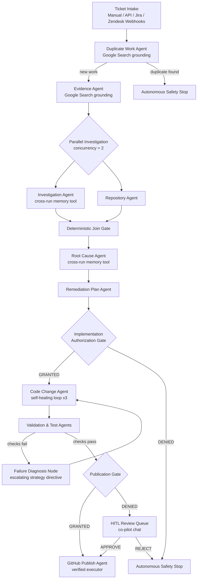

# SupportMaster

SupportMaster is an autonomous customer-support bug investigation and resolution agent.

It takes a support bug, gathers evidence, searches historical issues and code repositories, determines the likely root cause, proposes or implements a fix, runs tests, generates an RCA, and publishes only when the deterministic safety gates permit it. Explicit duplicates and malformed or unknown gate data stop the run. An incomplete duplicate search may continue read-only investigation, but it cannot authorize autonomous implementation or publication.

## Architecture

SupportMaster is a conditionally-routed ADK `Workflow` of 21 specialized agents,
governed by deterministic graph gates rather than LLM self-verification:



Every mutation is receipted, every gate decision is persisted to the state
contract, and blocked runs terminate through `autonomous_safety_stop` instead
of pausing silently.

### Agentic capability loop

- **Cross-run memory** (`supportmaster/tools/memory_tools.py`): resolved cases
  persist to a tenant-scoped SQLite FTS5 index at run completion; investigation
  and root-cause agents retrieve similar past fixes through a real ADK
  `FunctionTool` whose tenant comes from session state, never model arguments.
- **Web grounding**: duplicate and evidence agents carry ADK's built-in
  `google_search` tool under an instruction-level WEB SEARCH POLICY — public
  sources only, mandatory source URLs, EXTERNAL labeling, and external findings
  can never clear or fail a deterministic gate.
- **Diagnose-before-retry self-healing**: failed validation routes through a
  deterministic `failure_diagnosis` node that feeds escalating strategy
  directives (`REPRODUCE_AND_ISOLATE → NARROW_DIFF_SCOPE → ALTERNATIVE_APPROACH`)
  plus the last three failure warnings into the code-change agent before each
  retry; exhausted attempts roll back via receipted Git rollback.
- **Golden-path verified execution** (`scripts/golden-path.ps1`): one offline
  command runs grant check → Git preflight → scoped patch on `demo-target/` →
  real unittest subprocess → receipted commit on a dedicated branch. Every step
  emits an `ExternalOperationReceipt`.
- **Gemma triage** (`supportmaster/triage.py`): an additional Google model —
  Gemma (`gemma-3-27b-it` via the google-genai SDK) — performs cheap, advisory
  ticket classification (severity, category, duplicate suspicion) before the
  reasoning stages. Fail-open to a deterministic keyword heuristic when Gemma is
  unavailable; triage output never feeds any gate or authorization decision.
  Configure with `SUPPORTMASTER_TRIAGE_MODEL`.

## Hackathon Track

Taskmaster

## Status

Early development.

## Model selection

SupportMaster runs on **Gemini 3.5 or newer** by default (`gemini-3.5-flash`)
to satisfy hackathon eligibility rules. The runtime model picker uses
`supportmaster.config.supported_models()` and creates each execution through
`supportmaster.agent.create_root_agent(model)`. That factory creates an
isolated agent tree, so a selected model affects only the workflow run that
chose it. Deployments can tailor the allow-list with `SUPPORTMASTER_MODELS`.

Copy `.env.example` to `.env`, add `GOOGLE_API_KEY`, and optionally tailor the
picker allow-list with `SUPPORTMASTER_MODELS`.

Local runs persist ADK sessions and control-plane snapshots under
`.supportmaster/` by default. Override them with `SUPPORTMASTER_SESSION_DB`
and `SUPPORTMASTER_RUN_DB` when using a shared or managed SQLite location.

To open the local model picker:

```powershell
.\.venv\Scripts\python.exe -m supportmaster.web --port 8001
```

Then browse to `http://127.0.0.1:8001`. The official ADK developer UI remains
available at `http://127.0.0.1:8000`.

The application entrypoint now uses the conditionally routed ADK `Workflow`.
Duplicate work, review, validation/testing, and final audit decisions are
enforced by graph gates. The state contract also records policy version, gate
history, scoped authorization grants, and external-operation receipts. Git/GitHub
publication now goes through an injected verified executor; if adapters are not
configured, the run stops safely instead of allowing an LLM to claim publication.
Evidence ingestion now preserves sanitized source artifacts with SHA-256 hashes,
redaction metadata, and deterministic provenance. The reproducible `SUP-4821`
fixture set under `fixtures/sup-4821/` exercises the evidence-to-gate and
publication safety paths without network access.
The active workflow now fans out evidence and repository investigation after
duplicate verification, joins both results deterministically, and only then
starts root-cause analysis. The workflow concurrency limit defaults to two;
mutation stages remain serialized behind authorization gates.
Long-running local runs are backed by a durable task queue with worker leases,
heartbeats, checkpoints, retry/backoff, idempotency keys, cooperative pause and
cancel controls, and read-only replay plans. A process interruption leaves the
task reclaimable after its lease expires.
Production integrations are injected through least-privilege adapters for issue
tracking, CI, monitoring, notifications, and GitHub. Read operations are
allow-listed by default; mutations require explicit integration permissions,
target scopes, live mode, and still remain subject to workflow authorization.
The local default is dry-run and performs no external mutation.
Phase 9 adds durable observability: worker and integration lifecycle events
are redacted and correlated to runs/tasks, with local counters, latency
observations, and trace spans. SQLite-backed telemetry can be exported as an
operator timeline with a tamper-evident hash chain through
`supportmaster.telemetry.AuditExporter`.
Phase 10 adds production-operation controls: validated environment limits,
bounded concurrent-run admission, dependency circuit breakers, and local
liveness/readiness probes at `/health/live` and `/health/ready`. Oversized
tickets and runs beyond the configured concurrency budget fail closed before
they reach the model workflow.
Phase 11 adds security and governance controls. Deployments can enable
`SUPPORTMASTER_AUTH_MODE=REQUIRED` with hashed API-key credentials, scoped
principals, and tenant IDs. Run submissions require `RUN_EXECUTE`; readiness
requires `HEALTH_READ`; anonymous access remains deliberately limited in
`OPTIONAL` mode. Authenticated tenant and operator identity are persisted in
the run state and emitted as redacted security telemetry.
Phase 12 introduces the functional case boundary: `SupportCase` is a
vendor-neutral contract for manual, API, webhook, and issue-tracker intake.
Common field aliases are normalized into one case, unknown source fields are
preserved as metadata, and external IDs are idempotent per tenant/source.
The existing gated workflow can consume `SupportCase.workflow_text()` without
assuming Jira, GitHub, or a particular industry.
Phase 13 adds configurable organization context. Each tenant can define its
products, services, environments, severity vocabulary, ownership and
escalation rules, terminology, response style, repository mappings, and
workflow policy. Profiles are persisted and automatically included in case
execution; organizations can be created or updated through `POST
/api/organizations` with the `ORG_ADMIN` scope.
Phase 14 adds a general investigation platform. Evidence links preserve
provenance and confidence, related cases are searched within the tenant,
incidents can be correlated to services and products, repository signals come
through injectable search adapters, and missing evidence is classified as
critical, important, or optional. Each case receives a durable investigation
summary before model execution.
Phase 15 adds evidence-linked root-cause and remediation planning. Root-cause
assessments remain `UNKNOWN`, `POSSIBLE`, or `STRONGLY_SUPPORTED` until the
required signals exist. Remediation plans include risk, validation, rollback,
and regression considerations; even `READY` plans never authorize mutation on
their own.
Phase 16 adds controlled engineering execution. An approved implementation
grant is rechecked before preflight, code change, and validation; repository
paths must remain within the approved relative scope; failed validation can
trigger an explicit rollback adapter; and every attempted operation is stored
as a receipt. Without an injected code-change adapter, SupportMaster cannot
claim that source code was modified.
Phase 17 adds resolution, communication, and escalation assessment. The
functional layer separates implementation, validation, publication,
deployment, and customer confirmation. It generates customer-safe responses
only from verified state and produces a human-action escalation package when
closure conditions are not satisfied.
Phase 18 adds the functional case workspace. Operators can use `/workspace`
or the tenant-scoped `/api/cases` and `/api/cases/{case_id}` endpoints to view
case details, investigation gaps, planning, resolution, escalation, and linked
runs. Case status actions are persisted and tenant-checked.
Successful runs can reach completion autonomously;
blocked runs terminate through `autonomous_safety_stop` with no human-review
pause. The legacy always-on sequential workflow is no longer used by the

Phase 19 adds an organization-neutral functional evaluation suite. Fixtures
under `fixtures/cases/` are normalized and checked for canonical intake,
tenant-preserving investigation, explicit evidence gaps, and fail-closed
unverified resolution. New domains can add JSON fixtures without changing the
workflow code; SUP-4821 remains only an optional regression scenario.

Phase 20 adds configurable fixture expectations, onboarding acceptance, and
deterministic end-to-end workflow simulations. A fixture may declare expected
check outcomes under `evaluation.expectations`, while
`OrganizationAcceptanceSuite` verifies safe organization defaults and runs the
same functional scenarios under a newly configured tenant. The
`EndToEndWorkflowSuite` exercises intake, tenant-scoped investigation, and the
fail-closed resolution boundary without Gemini or external connectors.

Phase 22 adds an operator-facing workspace projection. Case snapshots now
include a workflow timeline, current stage, gate statuses, and a concrete next
action so operators can understand blocked or incomplete work without reading
raw workflow state.

Phase 23 adds `ReadOnlyIntegrationBundle`, a small composition layer for issue
tracker, monitoring, and CI reads. Every collected result remains paired with
an integration receipt; the default policy permits safe reads while mutations
remain blocked unless explicitly authorized.

Phase 24 adds the deterministic pre-demo quality pack. It combines functional
and end-to-end fixture suites, reports category/check coverage, and returns a
non-zero exit code when any configured expectation or safety check fails.

Phase 25 adds release-readiness checks for operation limits, authentication,
read-only integration defaults, SQLite readiness, and the quality pack. Run
`python -m supportmaster.release` before a deployment; use
`--allow-anonymous` only for local demo environments.

Phase 26 adds reproducible packaging and demo handoff. `Dockerfile`,
`docker-compose.yml`, and `scripts/demo.ps1` provide a clean setup, while
`docs/demo-runbook.md` documents the preflight, golden path, workspace, and
container presentation flow.

Phase 27 adds a tenant-scoped human-review queue projection. Operators can
inspect open review tasks through `ReviewQueueService` or `GET /api/reviews`
without exposing resume tokens or broadening approval scope.

Phase 28 adds review-queue operational metrics through
`ReviewQueueService.metrics` and `GET /api/reviews/metrics`, including status
counts, approval/rejection totals, open work, and tasks expiring within 24
hours. These metrics are observational only and do not alter workflow policy.

Phase 29 adds a redacted, tenant-scoped case activity timeline. Operators can
read `CaseWorkspaceService.activity` or
`GET /api/cases/{case_id}/activity` to inspect event types and timing without
exposing event payloads or secrets.

Phase 30 brings that audit timeline into the workspace UI, showing recent
durable activity alongside gate status and next action so the complete safety
story is visible in one operator screen.

Phase 31 adds the human-review queue summary to that same workspace, showing
open approvals, expiring tasks, and review outcomes without exposing resume
tokens or changing authorization behavior.
runner or local UI.

## Verification

Run the verified autonomous-fix golden path against the bundled fixture:

```powershell
.\scripts\golden-path.ps1
```

This seeds `.demo-workspace/`, applies the authorization-checked scoped fix,
runs the regression tests for real, and commits on
`supportmaster/sup-golden` — printing JSON receipts for every operation.

Run the offline functional demo with:

```powershell
.\.venv\Scripts\python.exe -m supportmaster.demo reset
.\.venv\Scripts\python.exe -m supportmaster.demo run
# Run specialized demo fixtures
.\.venv\Scripts\python.exe -m supportmaster.demo run --fixture fixtures/cases/AUTH-001.json
.\.venv\Scripts\python.exe -m supportmaster.demo run --fixture fixtures/cases/PERF-042.json
.\.venv\Scripts\python.exe -m supportmaster.demo run --fixture fixtures/cases/DATA-007.json
.\.venv\Scripts\python.exe -m supportmaster.quality
```

The demo uses the seeded SaaS authentication fixture, persists a local demo
organization, and prints the complete intake/investigation/resolution trace.
It does not call Gemini or mutate external systems. Use `seed` to initialize
the database without running the scenario.

Run the deterministic unit, memory, and routing tests with:

```powershell
python -m unittest discover -s tests -v
```

These tests do not call Gemini or require network access. Live ADK execution
still requires a valid API key and an account-enabled model.

## Google Cloud deployment

The included `Dockerfile` is Cloud Run-ready (respects `$PORT`, non-root user,
liveness/readiness probes). One-command deploy:

```powershell
.\scripts\deploy-cloudrun.ps1 -ProjectId <your-gcp-project> -Region us-central1
```

The script builds the image with Cloud Build, stores the API key in Secret
Manager, deploys both the web service and durable worker on Cloud Run Jobs,
and prints the public URL. Full step-by-step instructions live in
`docs/gcp-deployment.md`.

### Cloud Trace observability

When `GOOGLE_CLOUD_PROJECT` is set and the optional
`opentelemetry-exporter-gcp-trace` package is installed
(`pip install opentelemetry-exporter-gcp-trace`), workflow spans are exported
to **Cloud Trace** in addition to the console — making the multi-agent run
visible in the Google Cloud console. Without it, SupportMaster keeps the
zero-dependency console exporter so local demos never require GCP.

